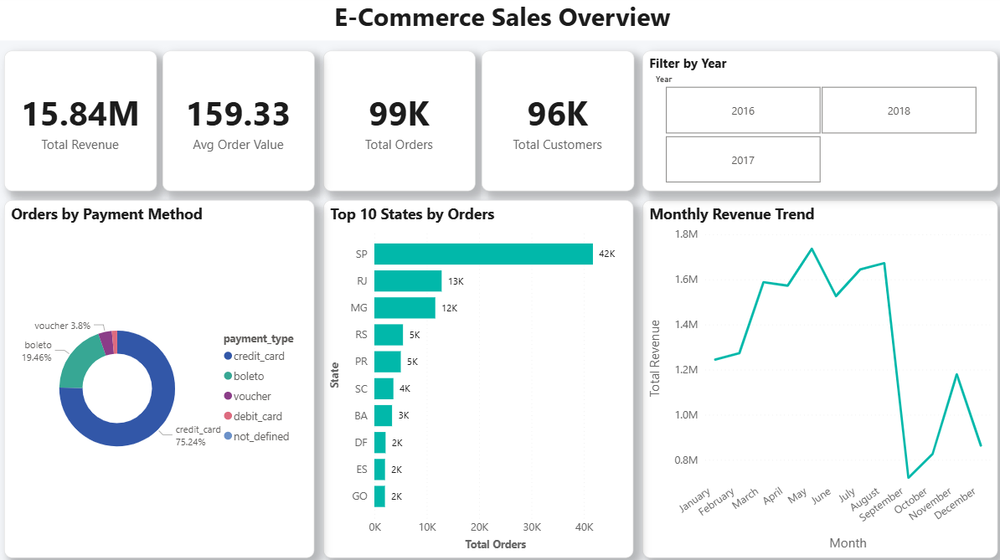
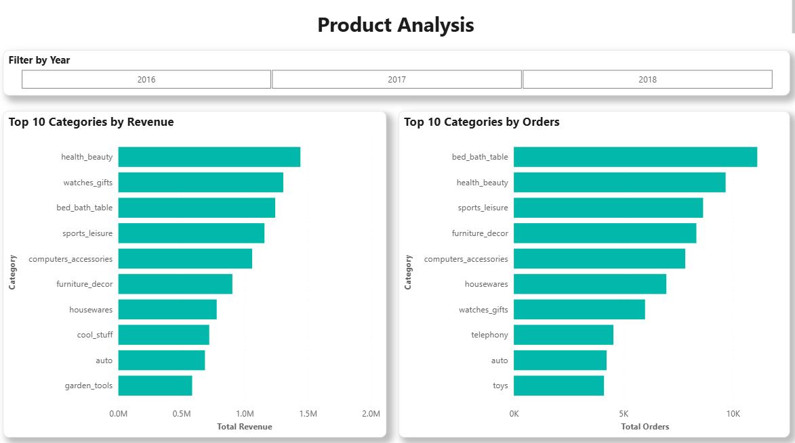
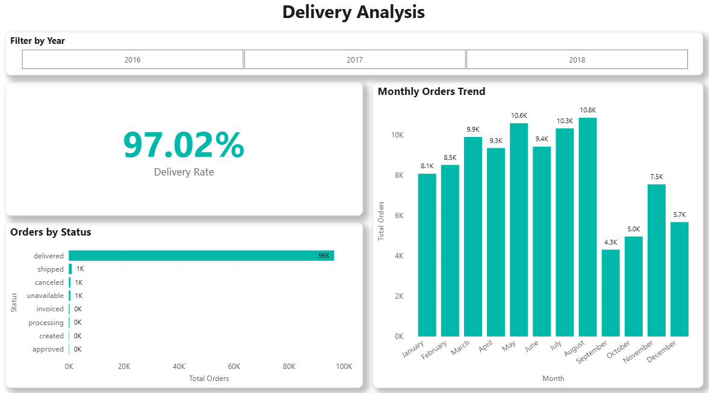
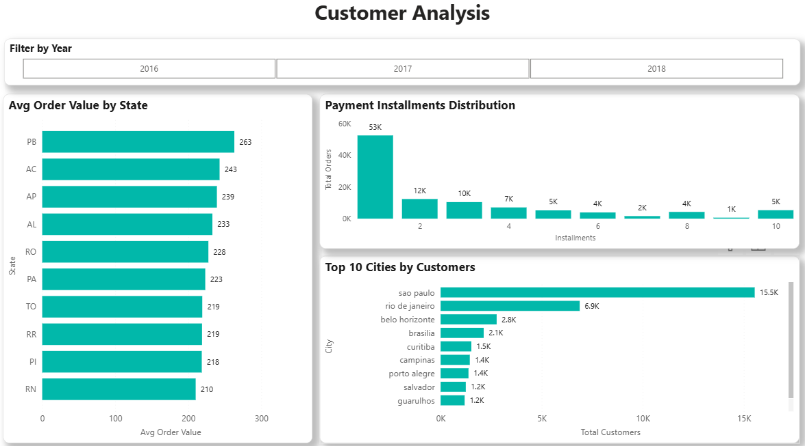

# Olist E-Commerce Data Analytics Project

## Project Overview
An end-to-end data analytics portfolio project built on the **Olist Brazilian E-Commerce dataset** from Kaggle. This project covers the complete data analytics pipeline — from raw data to interactive dashboard — simulating a real-world business analytics workflow.

---

## Objective
To analyze Olist's e-commerce operations and extract actionable business insights across:
- Sales & Revenue Performance
- Product Category Analysis
- Delivery & Operational Efficiency
- Customer Behavior & Geographic Distribution

---

## Dataset
- **Source:** [Kaggle - Brazilian E-Commerce Public Dataset by Olist](https://www.kaggle.com/datasets/olistbr/brazilian-ecommerce)
- **Size:** 8+ CSV files, 100,000+ orders (2016–2018)

| File | Description |
|------|-------------|
| olist_orders_dataset.csv | Order details and status |
| olist_order_items_dataset.csv | Items per order |
| olist_order_payments_dataset.csv | Payment information |
| olist_customers_dataset.csv | Customer details |
| olist_products_dataset.csv | Product information |
| olist_sellers_dataset.csv | Seller details |
| olist_order_reviews_dataset.csv | Customer reviews |
| product_category_name_translation.csv | Category name translations |

---

## Tools & Technologies

| Tool | Purpose |
|------|---------|
| Microsoft Excel | Data cleaning & preprocessing |
| MySQL | Data exploration & analysis |
| Power BI | Interactive dashboard & visualization |

---

## Project Workflow
```
Raw CSV Data → Excel (Cleaning) → MySQL (Analysis) → Power BI (Dashboard)
```

### 1. Data Cleaning (Excel)
- Removed duplicate records
- Handled missing/null values
- Standardized date formats (DD-MM-YYYY HH:MM)
- Fixed data type inconsistencies

### 2. SQL Analysis (MySQL)
Created database `olist_ecommerce` and analyzed:

| # | Analysis |
|---|----------|
| 1 | Total Revenue |
| 2 | Top 10 Product Categories by Revenue |
| 3 | Month-wise Orders Trend |
| 4 | Average Order Value |
| 5 | Top 10 States by Customers |
| 6 | Average Delivery Time |
| 7 | Popular Payment Methods |
| 8 | Late Deliveries % |
| 9 | Monthly Revenue Trend |
| 10 | Order Status Breakdown |

### 3. Power BI Dashboard (4 Pages)

---

## Dashboard Pages

### Page 1: E-Commerce Sales Overview

- **Total Revenue:** 15.84M
- **Average Order Value:** 159.33
- **Total Orders:** 99K
- **Total Customers:** 96K
- Orders by Payment Method (Donut Chart)
- Top 10 States by Orders (Bar Chart)
- Monthly Revenue Trend (Line Chart)
- Year Filter Slicer (2016, 2017, 2018)

### Page 2: Product Analysis

- Top 10 Categories by Revenue (Bar Chart)
- Top 10 Categories by Orders (Bar Chart)
- Year Filter Slicer

### Page 3: Delivery Analysis

- **Delivery Rate:** 97.02%
- Orders by Status (Bar Chart)
- Monthly Orders Trend (Bar Chart)
- Year Filter Slicer

### Page 4: Customer Analysis

- Avg Order Value by State (Bar Chart)
- Payment Installments Distribution (Column Chart)
- Top 10 Cities by Customers (Bar Chart)
- Year Filter Slicer

---

## Key Insights

1. **Credit Card dominates** — 75.24% of all payments made via credit card
2. **Sao Paulo leads** — SP state has the highest orders (42K) and customers (15.5K)
3. **Health & Beauty** is the top revenue-generating category
4. **Bed & Bath** has the highest number of orders but lower revenue per order
5. **97.02% delivery rate** — extremely high operational efficiency
6. **Most customers prefer 1 installment** (53K orders) for payment
7. **Peak months** — May, July, August have highest order volumes
8. **Revenue dipped** post-August 2018 — likely incomplete data for that period

---

## Project Structure
```
olist-ecommerce-analytics/
│
├── data/
│   ├── raw/                  # Original CSV files from Kaggle
│   └── cleaned/              # Excel cleaned files
│
├── sql/
│   └── analysis_queries.sql  # All 10 SQL analysis queries
│
├── Screenshots/
│   ├── sales_overview.png
│   ├── product_analysis.png
│   ├── delivery_analysis.png
│   └── customer_analysis.png
│
├── olist_dashboard.pbix      # Power BI dashboard file
│
└── README.md
```

---

## How to Run

### SQL Setup:
```sql
CREATE DATABASE olist_ecommerce;
USE olist_ecommerce;
-- Run table creation scripts
-- Import CSV data
-- Run analysis queries
```

### Power BI:
1. Open `olist_dashboard.pbix` in Power BI Desktop
2. Update data source path if needed
3. Refresh data

---

## Author
**Nitesh Sharma**
Data Analytics Portfolio Project

- LinkedIn: https://www.linkedin.com/in/nitesh-sharma-b55974232/
- GitHub: https://github.com/niteshsharmaattri

---

## License
This project is for educational and portfolio purposes only.
Dataset sourced from Kaggle under [CC BY-NC-SA 4.0](https://creativecommons.org/licenses/by-nc-sa/4.0/) license.